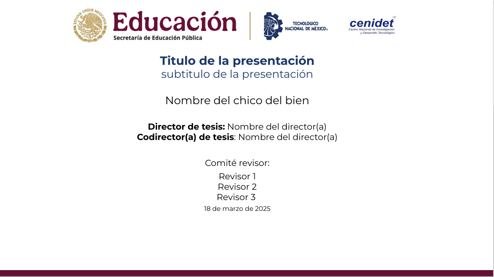

# Plantilla para presentaciones usando LaTeX
## Informacion general
Esta es una plantilla en Latex con los logos oficiales de la SEP y del CENIDET(no oficial)\
Fuente: Monstserrat
Fuente matematica: Stixtwomath

LaTeX : Tex_live
Rojo SEP : RGB 98, 17, 50
Azul TecNM : RGB 27,57,106
> [!TIP]
> Clona el repositorio y cambia el nombre del archivo template.tex 

> [!IMPORTANT]
> Usa el compilador LuaLatex

> [!WARNING]
> Si modificas los archivos del tema, es bajo tu propio riesgo y sabes lo que estas haciendo.

